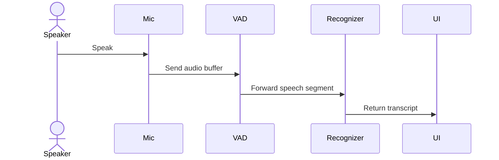
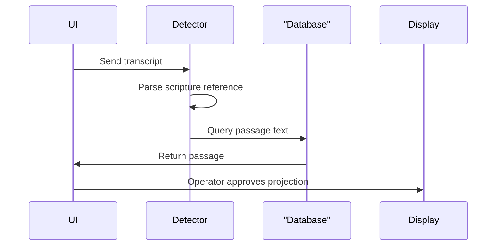

# Selah

## Project Overview

Selah helps operators manage church service presentations entirely offline. It captures local audio, detects spoken references, and prepares content for projection on a second screen. This allows teams to run reliable presentations without depending on internet connectivity or external cloud services.

## System Architecture


## Features

- **Local Speech Recognition**: Captures audio locally, processes it through voice activity detection, and transcribes it without cloud services.



- **Deterministic Content Detection**: Analyzes transcripts for scripture references and matches them against a local database for review before projection.



- **Multi-Monitor Presentation**: Manages separate windows for the operator interface and the congregation display, keeping controls hidden from the audience.
- **Media Management**: Imports and manages local images, videos, and audio metadata without moving large files around the disk.

## Design System

### Typeface

Selah uses **Creato Display** throughout — operator interface and projected
output alike, so every screen speaks with one voice.

- Self-hosted from `src/fonts/` and bundled by Vite. Selah never fetches a font
  over the network, because it has to run on a machine with no internet.
- Weights bundled: Light (300), Regular (400), Medium (500), Bold (700),
  Black (900). Italics are omitted — nothing in the interface uses them.
- Licensed under the **SIL Open Font License 1.1**, which permits embedding in
  an application. Copyright (c) 2021 Anugrah Pasau, with Reserved Font Name
  "Creato Display". Full text in `src/fonts/OFL.txt`; see
  `src/fonts/README.md` for provenance and how to add a weight.
- The reserved font name means the files must not be renamed or modified.

### Brand palette

Both colours are sampled directly from the logo artwork:

| Token          | Value     | Role                                     |
| -------------- | --------- | ---------------------------------------- |
| Logo gold      | `#C9A24B` | Brand mark, active navigation, buttons   |
| Logo navy      | `#141B2E` | Interface base, logo tile, icon          |

The neutral greys are tinted toward the logo navy, so the interface reads as one
brand rather than a grey theme with a gold highlight added afterwards.

Because the logo gold only reaches about 2.4:1 contrast against white, the light
theme uses a darkened version of the same hue for anything interactive. The logo
itself keeps the true gold and navy in both themes via `--brand-mark` and
`--brand-tile`, so the branding never shifts.

### Logo component

`src/components/ui/selah-icon.tsx` renders the logo. Use it everywhere the mark
appears rather than repeating the artwork:

```tsx
<SelahIcon size={26} tile />            // application mark, e.g. sidebar header
<SelahIcon size={120} />                // on a dark surface, e.g. projector slate
```

### Application icon

`src-tauri/icons/selah-icon.svg` is the source of truth for every platform icon
and uses the same 48-unit geometry as the component above. It is a rounded
squircle with a ~23% corner radius, matching how macOS and Windows round their
own application tiles. After editing it, regenerate the whole set:

```bash
pnpm tauri icon src-tauri/icons/selah-icon.svg
```

## Installation

- Clone the Repository:

```bash
git clone https://github.com/thevalidcode/selah.git
```

- Ensure you have Node.js 20 or higher, pnpm 9 or higher, and Rust 1.77 or higher installed on your system.
- Install frontend dependencies:

```bash
pnpm install
```

- Run the application in development mode:

```bash
pnpm tauri dev
```

- To enable real speech recognition using whisper.cpp, **three** things are needed. The build feature alone is not enough — Selah also needs a model, and the recognizer must be switched on in Settings:

1. Install the C++ build tooling (whisper.cpp is compiled from source):

```bash
brew install cmake
```

2. Build with the `whisper` feature:

```bash
pnpm tauri dev -- --features whisper
```

3. Put a model file on disk and point Settings at it. Selah never downloads models itself:

```bash
# The model can live anywhere; the app data directory is the documented default.
cp ~/Downloads/ggml-base.en.bin \
   "$HOME/Library/Application Support/app.selah.desktop/models/whisper/"
```

Then open **Settings → Microphone**, set **Speech recognizer** to *whisper*, and paste the **full path** to the model file. Relative paths are resolved against the process working directory, so prefer an absolute path.

If any of the three is missing, Selah still runs — it just reports *"Voice model ready: no"* on the Live screen and returns no words.

## Usage

When you first launch the application, you will be greeted by the setup screen. Follow the prompts to configure your environment.

1.  **Select a Microphone**: Choose the input device you want Selah to listen to.
2.  **Import a Bible Translation**: Navigate to Settings, select Database, and import a translation JSON file.
3.  **Choose a Display**: Select the monitor where the presentation window will appear.
4.  **Start Listening**: Go to the Live screen and click the Listen button to activate the audio pipeline.

Detected scripture will appear in the review panel. Click Display to send the content to the presentation window.

## Technologies Used

| Category     | Technology                                 |
| ------------ | ------------------------------------------ |
| Frontend     | React, TypeScript, Tailwind CSS, shadcn/ui |
| Backend      | Rust, Tauri                                |
| Database     | SQLite                                     |
| Audio/Speech | CPAL, whisper.cpp                          |

## API Documentation

The application backend uses Tauri IPC commands for communication with the frontend. Below are the registered endpoints.

#### [IPC] list_audio_devices

**Description**: Lists available audio input devices.

**Request**:

```json
{}
```

**Response**:

```json
{
  "status": "success",
  "data": [
    {
      "id": "device_1",
      "name": "Microphone",
      "isDefault": true,
      "defaultSampleRate": 48000,
      "channels": 2
    }
  ]
}
```

**Errors**:

- 500: Internal error fetching audio devices

#### [IPC] get_default_audio_device

**Description**: Returns the system default audio input device.

**Request**:

```json
{}
```

**Response**:

```json
{
  "status": "success",
  "data": {
    "id": "device_1",
    "name": "Microphone",
    "isDefault": true,
    "defaultSampleRate": 48000,
    "channels": 2
  }
}
```

**Errors**:

- 500: Audio query failed

#### [IPC] start_audio_capture

**Description**: Starts microphone capture using the configured device.

**Request**:

```json
{}
```

**Response**:

```json
{
  "status": "success",
  "data": {
    "capturing": true,
    "deviceId": "device_1",
    "sampleRate": 16000,
    "channels": 1,
    "bufferedSamples": 0
  }
}
```

**Errors**:

- 400: Audio device not found
- 500: Audio capture failed

#### [IPC] stop_audio_capture

**Description**: Stops active microphone capture.

**Request**:

```json
{}
```

**Response**:

```json
{
  "status": "success",
  "data": null
}
```

**Errors**:

- 500: Internal error stopping capture

#### [IPC] get_audio_capture_state

**Description**: Retrieves the current status of the audio pipeline.

**Request**:

```json
{}
```

**Response**:

```json
{
  "status": "success",
  "data": {
    "capturing": true,
    "deviceId": "device_1",
    "sampleRate": 16000,
    "channels": 1,
    "bufferedSamples": 512
  }
}
```

**Errors**:

- 500: Internal error getting state

#### [IPC] get_speech_state

**Description**: Retrieves the status of the speech recognition manager.

**Request**:

```json
{}
```

**Response**:

```json
{
  "status": "success",
  "data": {
    "listening": true,
    "recognizerId": "whisper",
    "modelLoaded": true,
    "vadEnabled": true,
    "segmentsSeen": 12,
    "transcriptsGenerated": 10
  }
}
```

**Errors**:

- 500: Internal error getting speech state

#### [IPC] start_listening

**Description**: Starts both microphone capture and the speech recognition worker.

**Request**:

```json
{}
```

**Response**:

```json
{
  "status": "success",
  "data": {
    "listening": true,
    "recognizerId": "whisper",
    "modelLoaded": true,
    "vadEnabled": true,
    "segmentsSeen": 0,
    "transcriptsGenerated": 0
  }
}
```

**Errors**:

- 500: Failed to spawn speech worker

#### [IPC] stop_listening

**Description**: Stops both the recognition worker and microphone capture.

**Request**:

```json
{}
```

**Response**:

```json
{
  "status": "success",
  "data": {
    "listening": false,
    "recognizerId": "whisper",
    "modelLoaded": true,
    "vadEnabled": true,
    "segmentsSeen": 5,
    "transcriptsGenerated": 5
  }
}
```

**Errors**:

- 500: Internal error stopping speech pipeline

#### [IPC] start_audio_pipeline

**Description**: Starts microphone capture only, without transcribing.

**Request**:

```json
{}
```

**Response**:

```json
{
  "status": "success",
  "data": {
    "capturing": true,
    "deviceId": "device_1",
    "sampleRate": 16000,
    "channels": 1,
    "bufferedSamples": 0
  }
}
```

**Errors**:

- 400: Audio device not found

#### [IPC] stop_audio_pipeline

**Description**: Stops the standalone microphone capture.

**Request**:

```json
{}
```

**Response**:

```json
{
  "status": "success",
  "data": null
}
```

**Errors**:

- 500: Internal error stopping audio

#### [IPC] detect_scripture

**Description**: Runs deterministic rule-based content detection on a transcript.

**Request**:

```json
{
  "transcript": "John chapter three verse sixteen"
}
```

**Response**:

```json
{
  "status": "success",
  "data": [
    {
      "content": {
        "type": "scripture",
        "reference": {
          "bookId": 43,
          "chapter": 3,
          "startVerse": 16,
          "endVerse": 16
        }
      },
      "confidence": 0.95
    }
  ]
}
```

**Errors**:

- 500: Detection internal error

#### [IPC] list_bible_translations

**Description**: Lists all imported Bible translations and their verse counts.

**Request**:

```json
{}
```

**Response**:

```json
{
  "status": "success",
  "data": [
    {
      "translation": {
        "id": "web",
        "name": "World English Bible",
        "language": "en",
        "abbreviation": "WEB",
        "isDefault": true,
        "createdAt": "2023-10-01T12:00:00Z"
      },
      "verseCount": 31102
    }
  ]
}
```

**Errors**:

- 500: Database error listing translations

#### [IPC] list_books

**Description**: Lists all canonical Bible books in the registry.

**Request**:

```json
{}
```

**Response**:

```json
{
  "status": "success",
  "data": [
    {
      "id": 1,
      "name": "Genesis",
      "testament": "Old",
      "abbreviation": "Gen",
      "chapters": 50
    }
  ]
}
```

**Errors**:

- 500: Database error listing books

#### [IPC] get_passage

**Description**: Fetches a single verse or range of verses from a specific translation.

**Request**:

```json
{
  "request": {
    "translationId": "web",
    "bookId": 43,
    "chapter": 3,
    "startVerse": 16,
    "endVerse": 16
  }
}
```

**Response**:

```json
{
  "status": "success",
  "data": {
    "translationId": "web",
    "reference": "John 3:16",
    "verses": [
      {
        "translationId": "web",
        "bookId": 43,
        "chapter": 3,
        "verse": 16,
        "text": "For God so loved the world..."
      }
    ],
    "text": "For God so loved the world..."
  }
}
```

**Errors**:

- 400: Invalid scripture reference
- 404: Bible translation or scripture not found
- 500: Database error

#### [IPC] search_bible

**Description**: Performs a full-text search across the Bible translation index.

**Request**:

```json
{
  "translationId": "web",
  "query": "love",
  "limit": 25
}
```

**Response**:

```json
{
  "status": "success",
  "data": [
    {
      "translationId": "web",
      "bookId": 43,
      "chapter": 3,
      "verse": 16,
      "text": "For God so loved the world..."
    }
  ]
}
```

**Errors**:

- 500: Database error during search

#### [IPC] set_default_translation

**Description**: Sets the default translation used when one is not explicitly specified.

**Request**:

```json
{
  "translationId": "web"
}
```

**Response**:

```json
{
  "status": "success",
  "data": null
}
```

**Errors**:

- 404: Bible translation not found
- 500: Database error setting default

#### [IPC] import_bible_translation

**Description**: Imports a Bible translation from a local JSON file path.

**Request**:

```json
{
  "path": "/Users/operator/Downloads/web-bible.json"
}
```

**Response**:

```json
{
  "status": "success",
  "data": {
    "translationId": "web",
    "versesImported": 31102
  }
}
```

**Errors**:

- 400: Invalid configuration or invalid import path
- 500: Database error during import

#### [IPC] get_presentation_state

**Description**: Returns the current state of the presentation engine queue.

**Request**:

```json
{}
```

**Response**:

```json
{
  "status": "success",
  "data": {
    "current": null,
    "queue": [],
    "history": []
  }
}
```

**Errors**:

- 500: Presentation engine error

#### [IPC] project_text

**Description**: Sends plain text to the presentation display.

**Request**:

```json
{
  "request": {
    "title": "Welcome",
    "text": "Please silence your phones.",
    "display": 1,
    "fullscreen": true
  }
}
```

**Response**:

```json
{
  "status": "success",
  "data": {
    "current": {
      "id": "item_1",
      "contentType": "text",
      "title": "Welcome",
      "payload": {
        "kind": "text",
        "text": "Please silence your phones."
      }
    },
    "queue": [],
    "history": []
  }
}
```

**Errors**:

- 400: Display not found
- 500: Presentation error

#### [IPC] project_passage

**Description**: Sends a Bible passage to the presentation display.

**Request**:

```json
{
  "passage": {
    "translationId": "web",
    "reference": "John 3:16",
    "verses": [],
    "text": "For God so loved the world..."
  }
}
```

**Response**:

```json
{
  "status": "success",
  "data": {
    "current": {
      "id": "item_1",
      "contentType": "scripture",
      "title": "web John 3:16",
      "payload": {
        "kind": "scripture",
        "reference": "John 3:16",
        "translation": "web",
        "text": "For God so loved the world..."
      }
    },
    "queue": [],
    "history": []
  }
}
```

**Errors**:

- 500: Presentation error projecting passage

#### [IPC] clear_presentation

**Description**: Clears the current content from the presentation display.

**Request**:

```json
{}
```

**Response**:

```json
{
  "status": "success",
  "data": {
    "current": null,
    "queue": [],
    "history": []
  }
}
```

**Errors**:

- 500: Presentation error clearing display

#### [IPC] open_presentation_window

**Description**: Opens the presentation window on a selected display monitor.

**Request**:

```json
{
  "display": 1,
  "fullscreen": true
}
```

**Response**:

```json
{
  "status": "success",
  "data": {
    "index": 1,
    "name": "Display 2",
    "size": [1920, 1080],
    "position": [1920, 0],
    "scaleFactor": 1.0,
    "isPrimary": false
  }
}
```

**Errors**:

- 400: Display not found
- 500: Presentation error opening window

#### [IPC] close_presentation_window

**Description**: Closes the presentation window.

**Request**:

```json
{}
```

**Response**:

```json
{
  "status": "success",
  "data": null
}
```

**Errors**:

- 500: Presentation error closing window

#### [IPC] set_presentation_display

**Description**: Sets the target display index for the presentation window.

**Request**:

```json
{
  "display": 1
}
```

**Response**:

```json
{
  "status": "success",
  "data": {
    "index": 1,
    "size": [1920, 1080],
    "position": [1920, 0],
    "scaleFactor": 1.0,
    "isPrimary": false
  }
}
```

**Errors**:

- 400: Display not found
- 500: Presentation error setting target

#### [IPC] set_fullscreen

**Description**: Toggles fullscreen mode for the presentation window.

**Request**:

```json
{
  "fullscreen": true
}
```

**Response**:

```json
{
  "status": "success",
  "data": null
}
```

**Errors**:

- 400: Display not found
- 500: Presentation error setting fullscreen

#### [IPC] list_displays

**Description**: Enumerates all monitors detected by the operating system.

**Request**:

```json
{}
```

**Response**:

```json
{
  "status": "success",
  "data": [
    {
      "index": 0,
      "name": "Built-in Display",
      "size": [1440, 900],
      "position": [0, 0],
      "scaleFactor": 2.0,
      "isPrimary": true
    }
  ]
}
```

**Errors**:

- 500: Display not found or error listing monitors

#### [IPC] list_presentations

**Description**: Lists all saved presentations.

**Request**:

```json
{}
```

**Response**:

```json
{
  "status": "success",
  "data": [
    {
      "id": "pres_1",
      "name": "Sunday Morning",
      "createdAt": "2023-10-01T12:00:00Z",
      "updatedAt": "2023-10-01T12:00:00Z"
    }
  ]
}
```

**Errors**:

- 500: Database error listing presentations

#### [IPC] get_presentation

**Description**: Retrieves a specific presentation and its ordered items.

**Request**:

```json
{
  "id": "pres_1"
}
```

**Response**:

```json
{
  "status": "success",
  "data": {
    "id": "pres_1",
    "name": "Sunday Morning",
    "createdAt": "2023-10-01T12:00:00Z",
    "updatedAt": "2023-10-01T12:00:00Z",
    "items": []
  }
}
```

**Errors**:

- 404: Presentation not found
- 500: Database error fetching presentation

#### [IPC] create_presentation

**Description**: Creates a new empty presentation.

**Request**:

```json
{
  "name": "Sunday Evening"
}
```

**Response**:

```json
{
  "status": "success",
  "data": {
    "id": "pres_2",
    "name": "Sunday Evening",
    "createdAt": "2023-10-01T18:00:00Z",
    "updatedAt": "2023-10-01T18:00:00Z"
  }
}
```

**Errors**:

- 500: Database error creating presentation

#### [IPC] delete_presentation

**Description**: Deletes a saved presentation.

**Request**:

```json
{
  "id": "pres_1"
}
```

**Response**:

```json
{
  "status": "success",
  "data": null
}
```

**Errors**:

- 500: Database error deleting presentation

#### [IPC] add_presentation_item

**Description**: Adds a new item payload to a saved presentation.

**Request**:

```json
{
  "request": {
    "presentationId": "pres_1",
    "type": "text",
    "payload": "{\"kind\":\"text\",\"text\":\"Welcome\"}"
  }
}
```

**Response**:

```json
{
  "status": "success",
  "data": null
}
```

**Errors**:

- 500: Database error adding item

#### [IPC] remove_presentation_item

**Description**: Removes a specific item from a saved presentation.

**Request**:

```json
{
  "presentationId": "pres_1",
  "itemId": "item_1"
}
```

**Response**:

```json
{
  "status": "success",
  "data": null
}
```

**Errors**:

- 400: Item not found in presentation
- 500: Database error removing item

#### [IPC] list_media

**Description**: Lists all imported media file metadata.

**Request**:

```json
{}
```

**Response**:

```json
{
  "status": "success",
  "data": [
    {
      "id": "media_1",
      "kind": "image",
      "name": "sermon-slide.png",
      "path": "/Users/operator/Pictures/sermon-slide.png",
      "createdAt": "2023-10-01T12:00:00Z"
    }
  ]
}
```

**Errors**:

- 500: Database error listing media

#### [IPC] import_media

**Description**: Imports media metadata by pointing to an absolute local file path.

**Request**:

```json
{
  "request": {
    "path": "/Users/operator/Pictures/sermon-slide.png"
  }
}
```

**Response**:

```json
{
  "status": "success",
  "data": {
    "id": "media_2",
    "kind": "image",
    "name": "sermon-slide.png",
    "path": "/Users/operator/Pictures/sermon-slide.png",
    "createdAt": "2023-10-01T12:05:00Z"
  }
}
```

**Errors**:

- 400: Invalid file path or file does not exist
- 500: Database error importing media

#### [IPC] remove_media

**Description**: Removes media metadata from the library without deleting the physical file.

**Request**:

```json
{
  "id": "media_1"
}
```

**Response**:

```json
{
  "status": "success",
  "data": null
}
```

**Errors**:

- 500: Database error removing media

#### [IPC] get_settings

**Description**: Retrieves the entire application settings document.

**Request**:

```json
{}
```

**Response**:

```json
{
  "status": "success",
  "data": {
    "general": {
      "appName": "Selah",
      "theme": "dark"
    },
    "audio": {
      "sampleRate": 0
    },
    "speech": {
      "recognizer": "mock",
      "threads": 4,
      "vadEnabled": true,
      "speechSampleRate": 16000
    },
    "presentation": {
      "fullscreen": true,
      "background": "#000000",
      "fontSize": 64,
      "followLive": true
    }
  }
}
```

**Errors**:

- 500: Database error fetching settings

#### [IPC] update_settings

**Description**: Updates the application settings document.

**Request**:

```json
{
  "request": {
    "settings": {
      "general": {
        "appName": "Selah",
        "theme": "dark"
      },
      "audio": {
        "sampleRate": 0
      },
      "speech": {
        "recognizer": "mock",
        "threads": 4,
        "vadEnabled": true,
        "speechSampleRate": 16000
      },
      "presentation": {
        "fullscreen": true,
        "background": "#000000",
        "fontSize": 64,
        "followLive": true
      }
    }
  }
}
```

**Response**:

```json
{
  "status": "success",
  "data": null
}
```

**Errors**:

- 500: Database error updating settings

#### [IPC] get_setup_state

**Description**: Returns the first-run configuration state of the application.

**Request**:

```json
{}
```

**Response**:

```json
{
  "status": "success",
  "data": {
    "completed": true,
    "hasTranslations": true,
    "hasModel": false
  }
}
```

**Errors**:

- 500: Database error reading setup state

#### [IPC] complete_setup

**Description**: Marks the first-run setup sequence as completed.

**Request**:

```json
{}
```

**Response**:

```json
{
  "status": "success",
  "data": null
}
```

**Errors**:

- 500: Database error writing setup state

## Contributing

Contributions are welcome. Please ensure your changes maintain the application's offline-first architecture. Do not introduce any cloud dependencies, external trackers, or telemetry into the codebase.

## Author Info

- LinkedIn: https://linkedin.com/in/thevalidcode
- X: https://x.com/thevalidcode

## Badges

[](https://www.typescriptlang.org/)
[](https://reactjs.org/)
[](https://tailwindcss.com/)
[](https://www.rust-lang.org/)
[](https://www.sqlite.org/)

[](https://dokugen.samueltuoyo.com)
